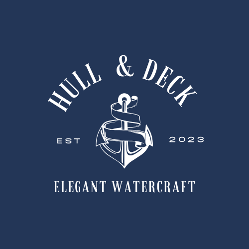

# Hull & Deck!



### "Elegant Watercraft"

- Hull & Deck is an eCommerce site that specializes in high-class watercraft.

## Screenshot of Application


## Link to Live Application

https://hull-and-anchor-a86df0a0dbad.herokuapp.com/

## Features

Users can:

- Create an account
- Login with account information
- Shop products and add products to their cart
- Checkout products from the cart

## Running the Application

-Simply clone down and in your command line run:

```bash
  npm run dev
```

## Starter Code Used

A step-by-step MERN setup was provided by instructor Gary Almes as part of the class lessons. This was utilized and can be found in the 2nd commit.

## Authors

- Annelise https://github.com/ascolardi
- Ben https://github.com/bpoole53
- Jon https://github.com/JJumangi
- Peter https://github.com/LauerPeter
- Salma https://github.com/mocha-matcha
